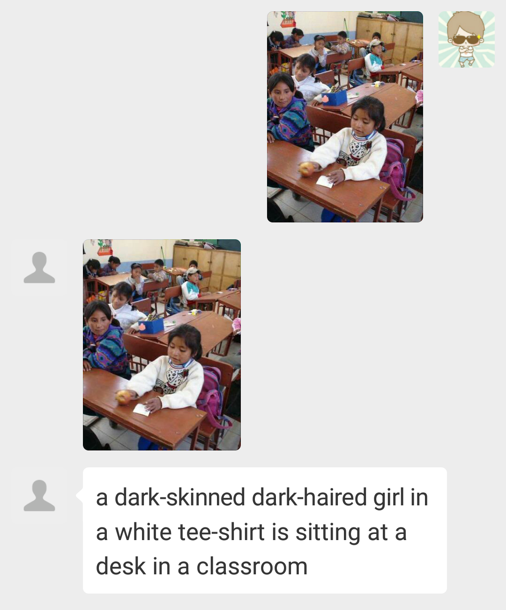

# 微信自动回复助手

## 功能

微信公众号消息自动回复。根据用户发送消息，回复消息。
现有功能：图片描述，视频描述

## 使用方法

需要提前按照RabbitMq，修改application.yml配置文件rabbitmq的配置，
host：port。

需要配置文件中修改appid、appsecret、token为自己公众号的appid等。

## 说明

图片描述需要另一个项目配合[autoReply_py](https://github.com/c-dafan/Wx_AutoReply_ImageCaption)

